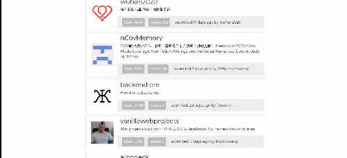

# Github-coding-challenge
A small webapp that lists the most starred Github repos that were created in the last 30 days, made with React.

    

## Install and Launch
	clone/pull the repository
	cd github-coding-challenge
	npm install
    npm start

## Usage 
<a href="https://featured-repositories.herokuapp.com/" target="_blank">LIVE DEMO</a>. 
This app was made using github api which allows only the first 1000 results.

